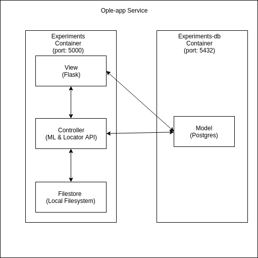

# Ople-app
#### A Simple microservice application to track machine learning experiements

Project aims to provide REST endpoints to creating an machine learning experiment, train and test a model and provide prediction related inference.   

Prerequiste: 
Docker, Docker-compose 

To execute this app execute following commands

>chmod 755 exeperiments.sh

>./experiments.sh 

App Services Architecture

There are two services

  Experiments Container which hosts Flask and ML api’s which acts as View
and controller. Also its local filesystem is used as filestore.

  Experiments-db Services which hosts Postgres Database which Model

